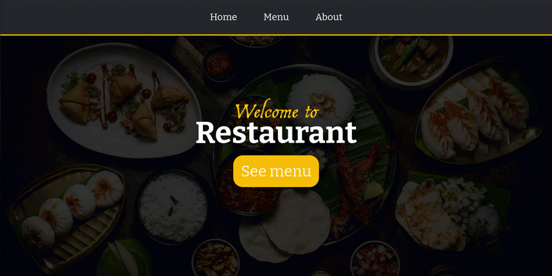

# Restaurant_Page

This is a simple project in which I utilize webpack bundler for creating multiple-page restaurant website.

**Link to project:** https://defalterxd.github.io/Restaurant_Page/

## How It's Made:

**Tech used:** HTML, CSS, JavaScript, Webpack

For this project I firstly configured webpack for it to work, then set up my pages as a mockup inside html and styled it after css. After that I begin to build up modules for my pages to make tab behavior through links in the header.

Though for working with classes I was needed to download the 'babel-loader' package in order to work.

## Lessons Learned:

In this project I learned:

<ul>
    <li>How to set up my webpack</li>
    <li>Bundling all my javascript through entry point and command</li>
    <li>Using classes and module syntax</li>
    <li>Deploy my pages through another branch with subtree</li>
</ul>

## References:

All images was from the freepik of unsplash.